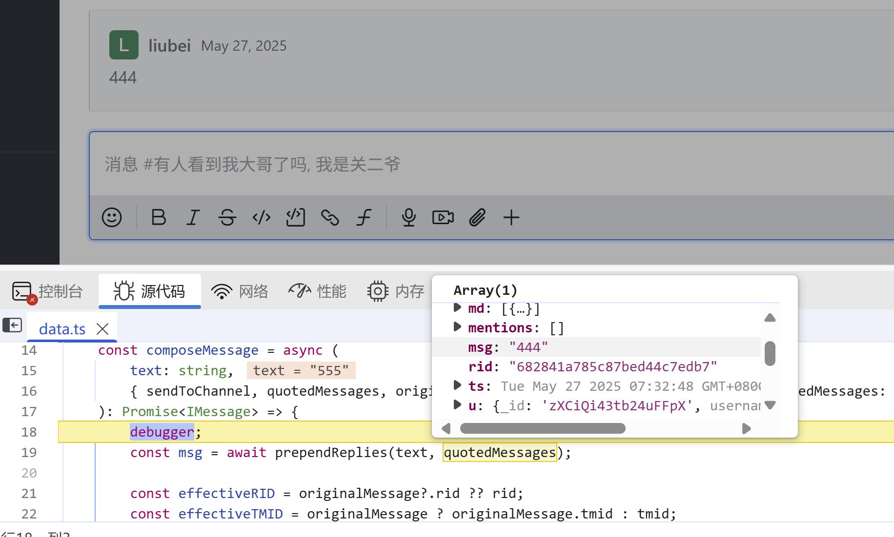
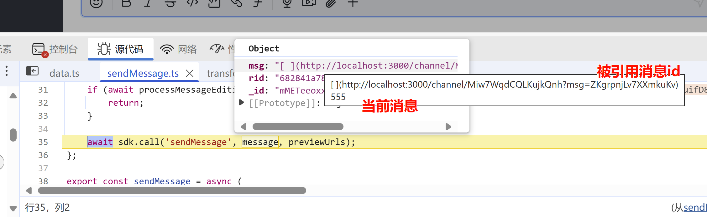

# 需求: 引用消息增强: 支持消息串起来

人都是懒惰的, 引用的方式回复比讨论串轻松.

引用消息自带的功能没有组成串的相关字段. 

联想讨论串, tlm + tmid , tmid 就将串内的消息都能捞出来. 里面的引用不过是额外增加被回复者信息.

引用消息, 也想类似方式串起来.

**思路**

rocketchat_message 表增强改造.
1. 第一条引用消息, 将本引用消息, 增加两个字段
   - qlm : 时间类型, 最新引用消息生成的时刻, 能标识它是引用头消息. 它的第一条引用消息,  发现它没有 qmid, 便知它是头消息, 然后添加此字段.
   - qm_count : 引用消息计数
2. 引用消息, 增加 qmid 字段, 即引用头消息的 _id. 逐层往下继承复制过去.

qlm 暂定位新增引用时更新吧, 编码简单些. tlm 也是会更新的.

我猜测, 主要要在引用消息生成的时候, 做些增强操作.


## 头消息的引用怎么处理?

1. 头消息被引用(头节点)
2. 或引用(子节点)
3. 讨论组 或 讨论串 涉及到

讨论组
- 姓名
- 话题
- 引用消息(没有引用串关联字段的), 基于现有消息创建时才有. msg空, 内容在 attachments 里.

展示思路:
头消息前后引用节点一起, 作为话题自身的回复.
参考 segmentfault 论坛设计, 问题本身下可有回复列表. 然后, 回答有自己回复列表.
问题本身的回复, 相当于是对问题的进一步描述. 让参与者们更能了解问题的背景.


---

我来帮你分析实现引用消息串的增强功能。根据需求文档，我们需要在 Rocket.Chat 的消息系统中增加引用消息串的功能。让我先查看一下相关的代码实现。


Ran tool
让我再具体搜索一下消息模型的定义：


Ran tool
让我直接查看消息模型文件：


Read file: app/models/server/Messages.ts
让我看看项目结构：


Ran tool
让我查看一下 apps 目录：


Ran tool
让我继续深入查看 meteor 目录：


Ran tool
让我查看消息相关的代码：


Ran tool
基于代码分析，我来给出实现引用消息串的增强功能的思路：

1. 数据库模型修改
- 在 `Messages` 集合中增加两个新字段:
  - `qlm`: Date 类型，记录第一条引用消息的时间戳
  - `qm_count`: Number 类型，记录引用消息计数
  - `qmid`: String 类型，记录引用头消息的 _id

1. 消息发送逻辑修改
- 在发送引用消息时，需要判断:
  - 如果被引用的消息没有 `qmid`，说明它是引用头消息，需要:
    1. 设置 `qlm` 为当前时间
    2. 设置 `qm_count` 为 1
    3. 设置 `qmid` 为自己的 `_id`
  - 如果被引用的消息有 `qmid`，说明它已经是引用串的一部分，需要:
    1. 继承被引用消息的 `qmid`
    2. 更新引用头消息的 `qm_count` 计数

1. 消息查询逻辑修改
- 增加按引用串查询的功能:
  - 可以通过 `qmid` 查询同一引用串的所有消息
  - 可以通过 `qlm` 排序显示引用串的时间顺序
  - 可以通过 `qm_count` 显示引用串的长度

1. UI 展示优化
- 在消息展示时:
  - 显示引用串的上下文关系
  - 可以通过 `qm_count` 显示引用串的长度
  - 提供查看完整引用串的功能

1. 具体实现步骤:

```typescript
// 1. 修改消息发送逻辑
async function sendQuoteMessage(message, quotedMessage) {
  if (!quotedMessage.qmid) {
    // 被引用消息是头消息
    message.qlm = new Date();
    message.qm_count = 1;
    message.qmid = message._id;
  } else {
    // 被引用消息已经是引用串的一部分
    message.qmid = quotedMessage.qmid;
    // 更新头消息的计数
    await Messages.updateOne(
      { _id: quotedMessage.qmid },
      { $inc: { qm_count: 1 } }
    );
  }
  
  // 发送消息
  return sendMessage(message);
}

// 2. 查询引用串
async function getQuoteChain(qmid) {
  return Messages.find(
    { qmid },
    { sort: { qlm: 1 } }
  ).toArray();
}
```

6. 注意事项:
- 需要处理消息删除的情况，更新引用计数
- 需要处理消息编辑的情况，保持引用关系
- 需要考虑性能优化，避免频繁更新计数
- 需要添加适当的索引提升查询性能

7. 迁移策略:
- 对于已有的引用消息，可以:
  1. 保持现有功能不变
  2. 新功能只对新的引用消息生效
  3. 或者编写迁移脚本，为历史数据添加新字段

这样的实现可以让引用消息形成串状结构，方便用户追踪和查看完整的对话上下文。同时保持了与现有功能的兼容性，可以平滑升级。


引用消息按钮

// apps/meteor/client/components/message/toolbar/items/actions/QuoteMessageAction.tsx
const QuoteMessageAction = ({ message, subscription }: QuoteMessageActionProps) => {
  const chat = useChat();
  return (
    <MessageToolbarItem
      id='quote-message'
      icon='quote'
      title={t('Quote')}
      onClick={() => {
        chat?.composer?.quoteMessage(message);
      }}
    />
  );
};

chat?.composer?.quoteMessage(message);
追加到了 _quotedMessages
apps/meteor/app/ui-message/client/messageBox/createComposerAPI.ts
这个可能只是消息发送框UI变化?

消息发送按钮
```js
// apps/meteor/client/views/room/composer/messageBox/MessageBox.tsx
const MessageBox = () => {
  return (
    <MessageComposer>
      <MessageComposerToolbar>
        <MessageComposerToolbarSubmit>
          <MessageComposerAction
            icon='send'
            onClick={handleSendMessage}
          />
        </MessageComposerToolbarSubmit>
      </MessageComposerToolbar>
    </MessageComposer>
  );
};
```

总结一下引用消息的流程：
用户点击消息工具栏中的引用按钮
QuoteMessageAction 组件调用 chat.composer.quoteMessage() 方法
被引用的消息会显示在输入框上方，通过 MessageBoxReply 组件渲染
用户输入回复内容后点击发送按钮
MessageBox 组件调用 handleSendMessage 方法发送消息
服务器端处理引用消息，添加 qlm、qm_count 和 qmid 字段  (准备要增强的能力)
消息显示在聊天界面中，引用部分通过 QuoteAttachment 组件渲染






引用消息即使发送到后端

apps/meteor/app/lib/server/functions/sendMessage.ts 
开始的位置. 猜测是在后面要去解析处理的.

```json
{
  _id: 'mA2KN76BraSZ55LNN',
  rid: '682841a785c87bed44c7edb7',
  msg: '[ ](http://localhost:3000/channel/Miw7WqdCQLKujkQnh?msg=mMETeeoxxqqQvBLvt)\n' +
    '666',
  ts: 2025-06-06T15:34:32.592Z,
  u: { _id: 'HqB7wxtqQQRuifD84', username: 'guanyu', name: '关羽' }
}
```
mMETeeoxxqqQvBLvt 是直接被引用消息的id.


```js
// apps/meteor/app/lib/server/functions/sendMessage.ts
message = await Message.beforeSave({ message, room, user });

// apps/meteor/server/services/messages/service.ts
message = await this.jumpToMessage.createAttachmentForMessageURLs({
  message,
  user,
  config: {
    chainLimit: settings.get<number>('Message_QuoteChainLimit'),
    siteUrl: settings.get<string>('Site_Url'),
    useRealName: settings.get<boolean>('UI_Use_Real_Name'), // 这个配置会影响 author_name 是姓名还是用户名
  },
});
```

```json
{
   _id: 'xGBvAAqDKSk7iLY6J',
   rid: '682841a785c87bed44c7edb7',
   msg: '[ ](http://localhost:3000/channel/Miw7WqdCQLKujkQnh?msg=mA2KN76BraSZ55LNN)\n' +
     '777',
   ts: 2025-06-07T05:39:17.817Z,
   u: { _id: 'HqB7wxtqQQRuifD84', username: 'guanyu', name: '关羽' },
   _updatedAt: 2025-06-07T05:39:17.924Z,
   urls: [
     {
       url: 'http://localhost:3000/channel/Miw7WqdCQLKujkQnh?msg=mA2KN76BraSZ55LNN',
       meta: {},
       ignoreParse: true
     }
   ],
   mentions: [],
   channels: [],
   md: [
     { type: 'PARAGRAPH', value: [Array] },
     { type: 'PARAGRAPH', value: [Array] }
   ],
   attachments: [
     {
       text: '[ ](http://localhost:3000/channel/Miw7WqdCQLKujkQnh?msg=mMETeeoxxqqQvBLvt)\n' +
         '666',
       md: [Array],
       message_link: 'http://localhost:3000/channel/Miw7WqdCQLKujkQnh?msg=mA2KN76BraSZ55LNN',
       author_name: 'guanyu',
       author_icon: '/avatar/guanyu',
       attachments: [Array],
       ts: 2025-06-06T15:34:32.592Z
     }
   ]
 }
```

## 引用消息怎么处理和发送的?

```js
// apps/meteor/client/views/room/contextualBar/Threads/components/ThreadChat.tsx
<ComposerContainer
							tmid={mainMessage._id}
							subscription={subscription}
							onSend={handleSend} // 这个只是回调

// apps/meteor/client/views/room/composer/ComposerMessage.tsx
...
onSend:
...
try {
					await chat?.action.stop('typing');
					const newMessageSent = await chat?.flows.sendMessage({
						text,
						tshow,
						previewUrls,
						isSlashCommandAllowed,
					}); // 发送核心逻辑在这
					if (newMessageSent) onSend?.(); // 发送后, 回调上层传来的 onSend (如有)
				} catch (error) {
					dispatchToastMessage({ type: 'error', message: error });
				}

// apps/meteor/client/lib/chats/flows/sendMessage.ts
const message = await chat.data.composeMessage(text, {
			sendToChannel: tshow,
			quotedMessages: chat.composer?.quotedMessages.get() ?? [],
			originalMessage: chat.currentEditing ? await chat.data.findMessageByID(chat.currentEditing.mid) : null,
		});
```
```js
// apps/meteor/client/lib/chats/data.ts
export const createDataAPI = ({ rid, tmid }: { rid: IRoom['_id']; tmid: IMessage['_id'] | undefined }): DataAPI => {
  // chat.data.composeMessage -->
	const composeMessage = async (
		text: string,
		{ sendToChannel, quotedMessages, originalMessage }: { sendToChannel?: boolean; quotedMessages: IMessage[]; originalMessage?: IMessage },
	): Promise<IMessage> => {
		const msg = await prependReplies(text, quotedMessages); // 核心只要引用消息的_id, getPermaLink(_id)

		const effectiveRID = originalMessage?.rid ?? rid;
		const effectiveTMID = originalMessage ? originalMessage.tmid : tmid;

		return {
			_id: originalMessage?._id ?? Random.id(),
			rid: effectiveRID,
			...(effectiveTMID && {
				tmid: effectiveTMID,
				...(sendToChannel && { tshow: sendToChannel }),
			}),
			msg,
		} as IMessage;
	};
```

`chat.data: DataAPI` 来自 `createDataAPI({ rid, tmid })`


ComposerMessage > MessageBox handleSendMessage

## 讨论串的头消息也有引用怎么处理?

tlm, qlm 都有.
讨论串的头消息同时也有引用消息. 即 tlm和qlm都存在. 此时, 回复消息列表要将这两类串合并到一起