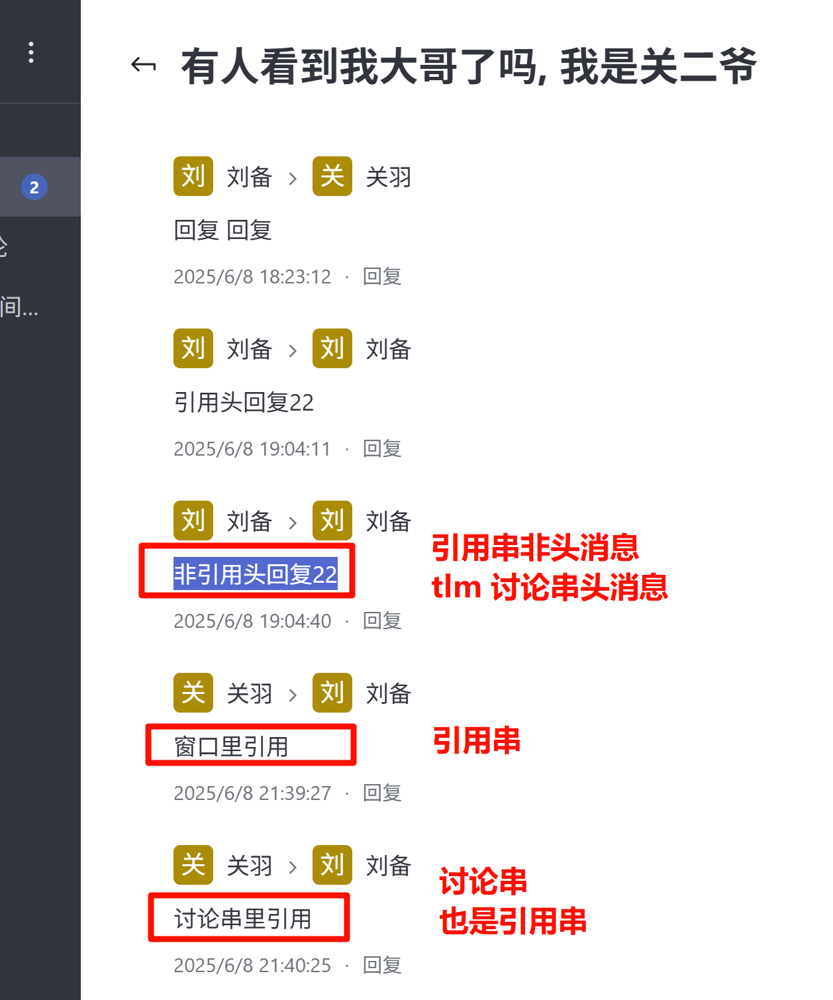

聊天窗中某条引用消息, 创建讨论 ("在讨论串中回复")
引用串头同时也是讨论串头, 这个已经解决了. 聚合两类串到一起作为回复列表.
这里要解决的是引用串非头, 但是是讨论串的头.

暂简单处理:
1. 各自展示各自的串, 讨论串里的引用回复会冗余显示. 引用串上显示一遍, 讨论串里也会有显示.
2. 讨论串节点地位更高, 所以即使作为引用串的非头节点, 也会单独单开一条评论展示回复串.
3. 同时是讨论串和引用串节点被回复时, 带上讨论串tmid, 这样就自动优先在讨论串聊天窗里显示. (原生如此)

遇到这样的节点, 即分叉. 引用串归引用串, 讨论串归讨论串.

后续进一步, 让它在引用串的位置, 可跳转到单开的评论位置?