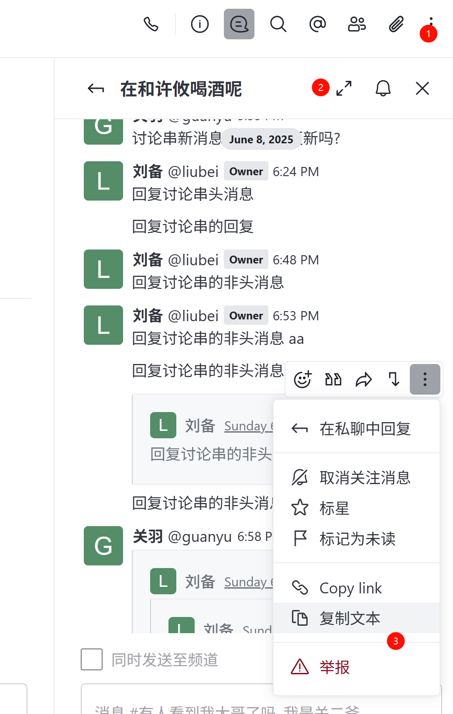
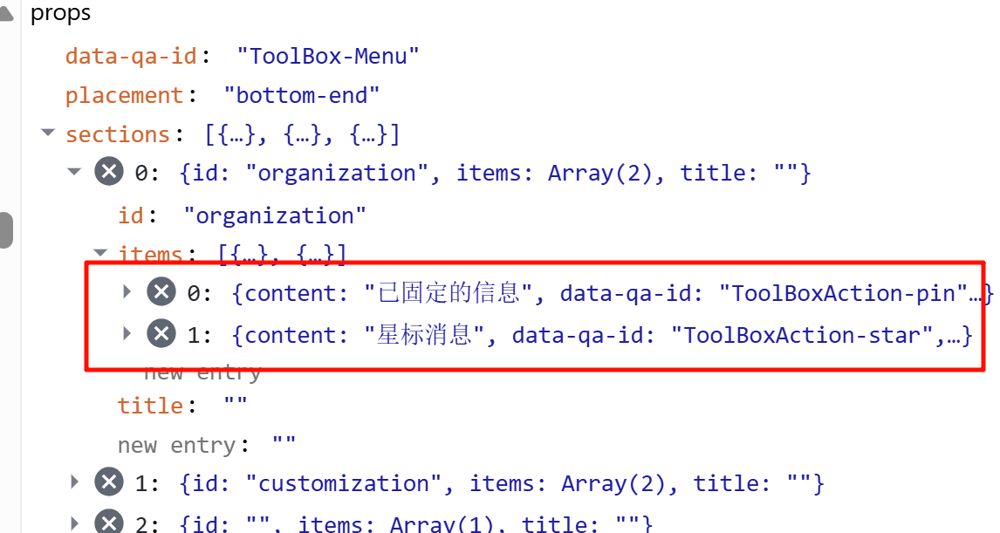

## 概要



1. 讨论: 工具条右上方, "..." 里增加跳转
2. 讨论串: 右上方, 增加跳转
3. 引用, 讨论串和聊天窗里一样, 引用串任意消息, "..." 中增加跳转

## 讨论跳转

1. 找到讨论窗口右上方展开按钮组位置, 追加一行. "帖子图标+话题页+跳转图标".
2. 点击跳转 topics-detail 路由, 带过去消息 _id
```js
router.navigate({
    name: 'topics-detail',
    params: { id: topicId }, // 带过去消息_id
    search: { drid },
});
```

<GenericMenu title={t('Options')} data-qa-id='ToolBox-Menu' sections={hiddenActions} placement='bottom-end' />
sections 传入的选项


useRoomToolboxActions 对传入的 actions 划分, 哪些该直接显示, 哪些该初始隐藏.
actions 来自 useRoomToolbox()

<RoomToolboxContext.Provider value={contextValue}>{children}</RoomToolboxContext.Provider>;

contextValue 设置 actions
来自 
const coreRoomActions = useCoreRoomActions();
const appsRoomActions = useAppsRoomActions();

apps/meteor/client/ui.ts
roomActionHooks

比如
apps/meteor/client/hooks/roomActions/useChannelSettingsRoomAction.ts

Action 聚集在 roomActions 目录下.

useRoomToolboxActions
缺省补充
content
onClick
data-qa-id
按 type 聚合, 没有聚合到 ''
